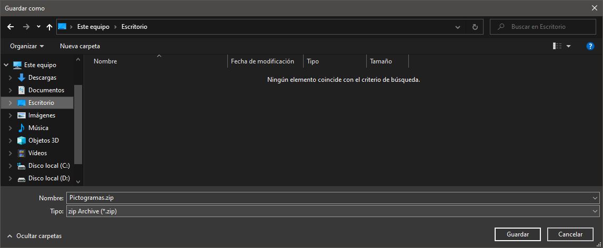
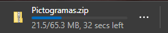
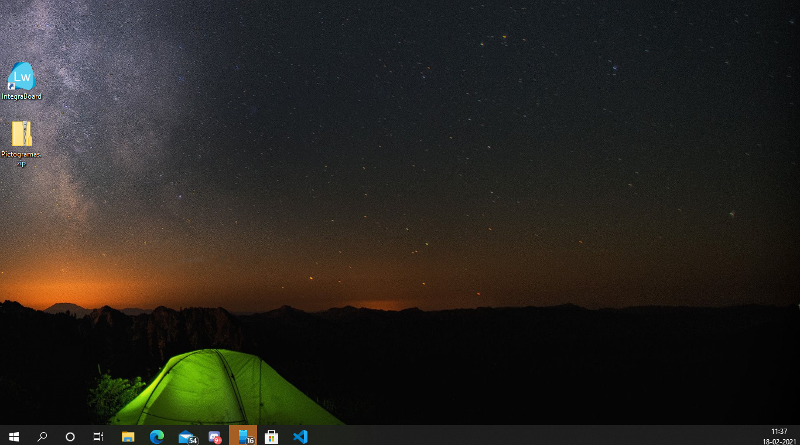
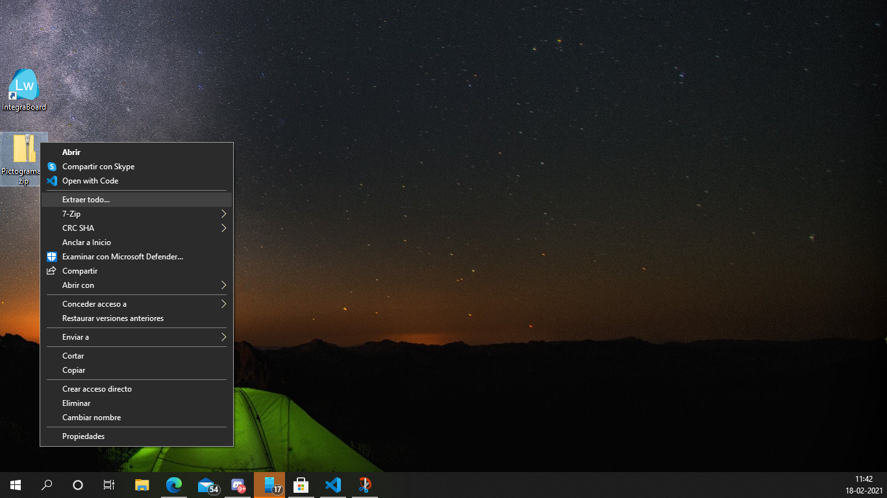
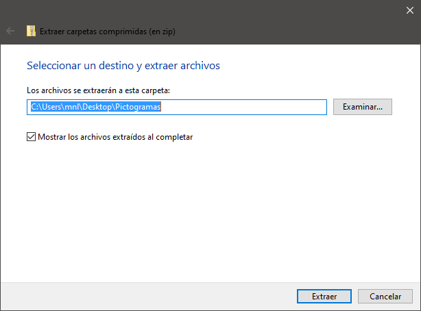
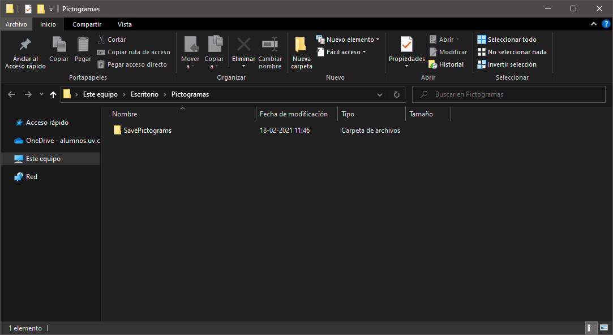

### Prerrequisitos

- Conxión a internet.

## Paso a paso

### Descarga

1. Los pictogramas se pueden descargar desde [AQUÍ](http://updates.lifeware.cl/Recursos/Pictogramas.zip) o el siguiente enlace:

    <http://updates.lifeware.cl/Recursos/Pictogramas.zip>

2. Aparecerá una ventana preguntando en donde se guardará la descarga (se recomienda guardar en el escritorio). Luego, presionar el botón "Guardar".

3. El navegador comenzará la descarga y mostrará algo así.

### Descompresión

1. Al finalizar la descarga, en el directorio donde se descargó, se mostrará el archivo de los pictogramas

2. Con el puntero del mouse sobre el archivo descargado, y seleccione la opción "Extraer todo...".

3. Se abrirá una ventana preguntando donde se quiere guardar, luego presione en extraer para comenzar la descompresión de los pictogramas.

4. Al finalizar la descompresión, se mostrará la carpeta donde se extrajeron los pictogramas.

## Siguientes pasos

- [Importar pictogramas a IntegraBoard](./importar-pictogramas-a-integraboard.md)