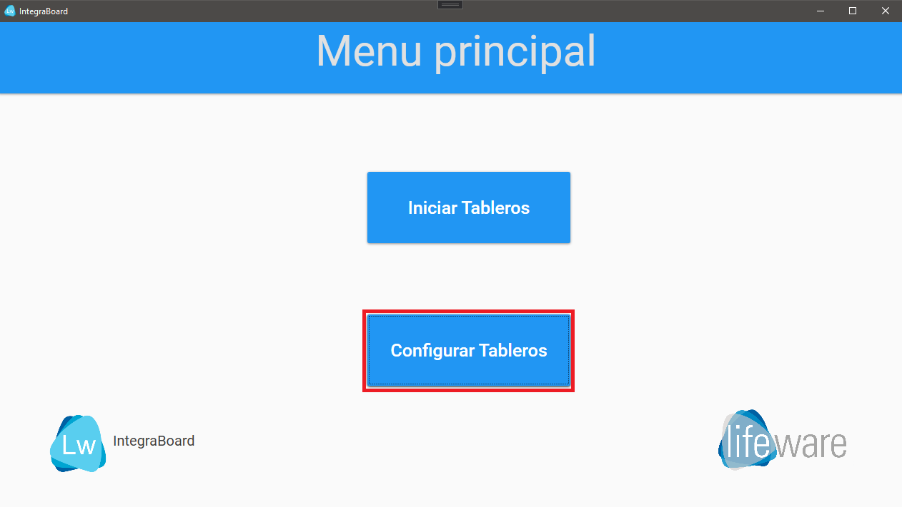
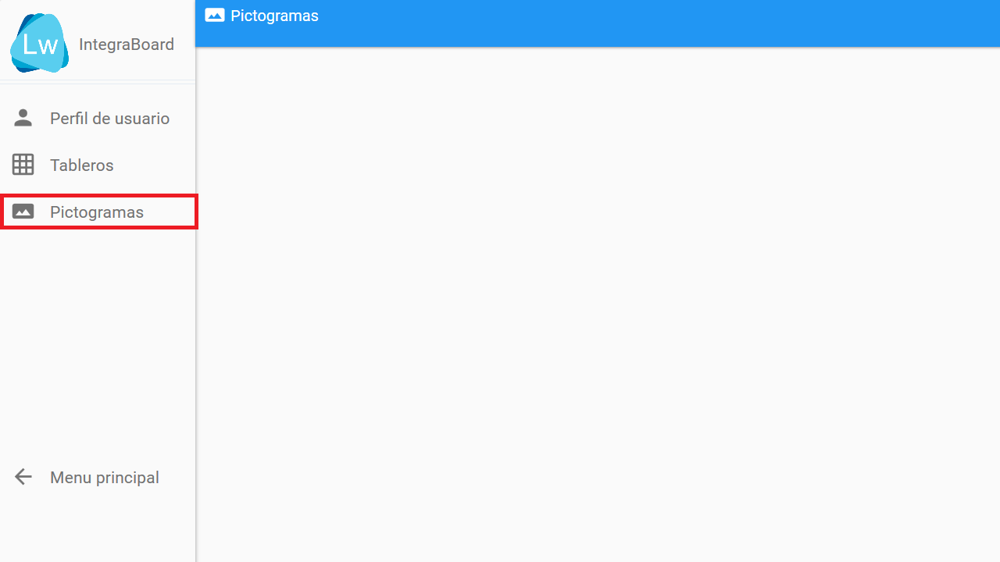
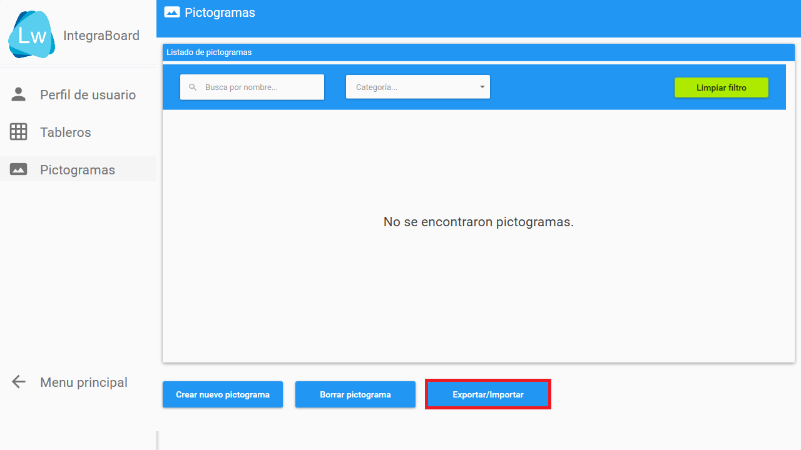
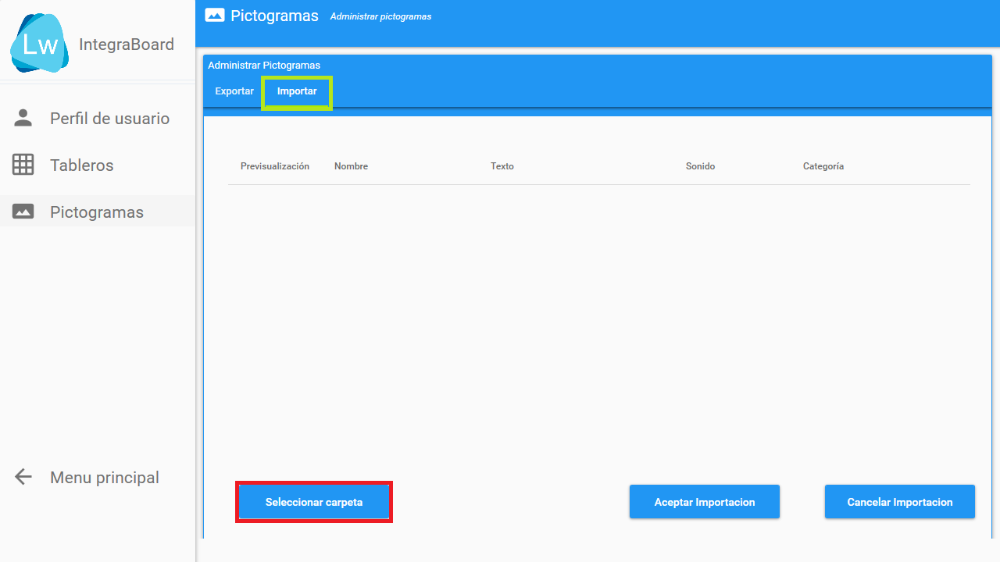
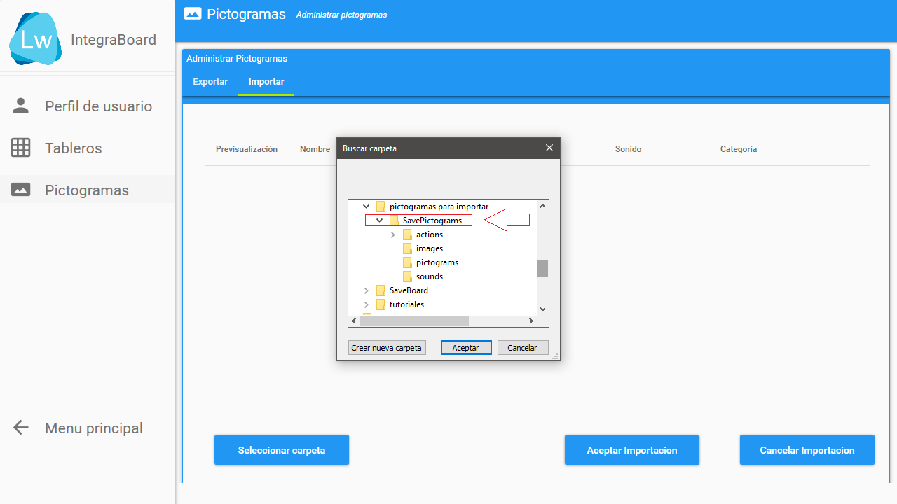
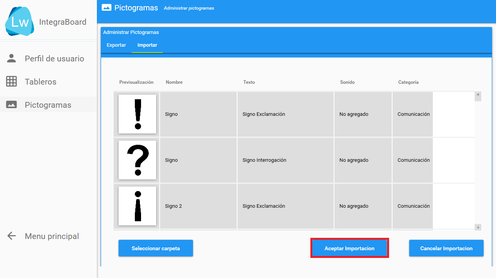
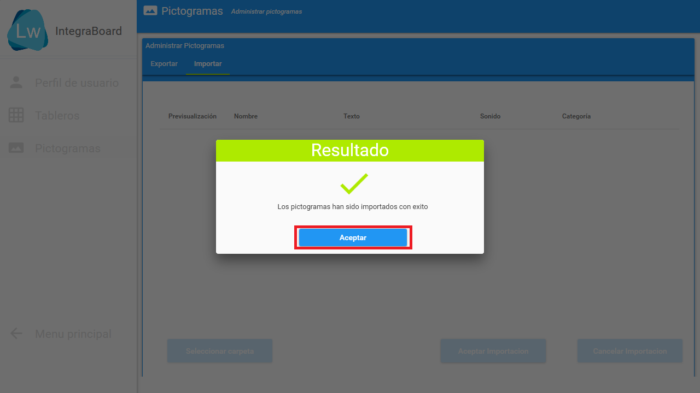
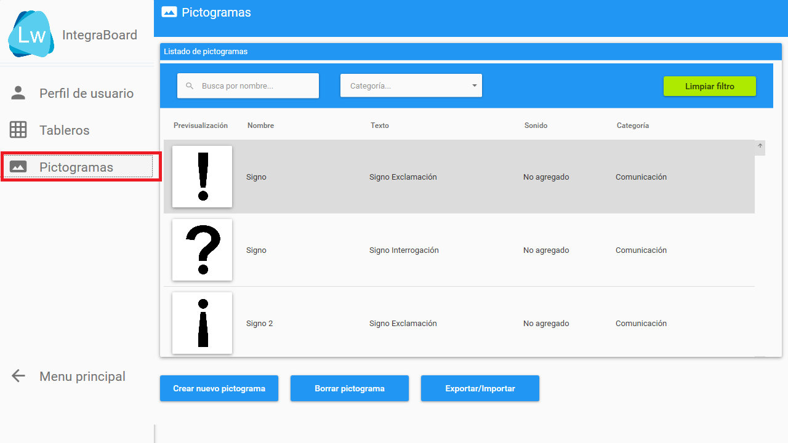

### Prerrequisitos

- Perfil creado.
- Pictogramas descargados y descomprimidos ([Tutorial]).

## Paso a paso

1. Seleccionar el botón "Configurar tableros".

2. En la nueva ventana, seleccionar el botón "Pictogramas".

3. En la sección de pictogramas, seleccione el botón "Exportar/Importar".

4. Dentro del módulo "Exportar/importar" seleccionar "Importar" (marcado en verde) y luego el botón "Seleccionar carpeta".

5. En la ventana que se que abrió, elija la carpeta que contiene los pictogramas descargados y seleccione el botón "Aceptar".

6. Comenzará a cargar una lista con todos los pictogramas que se importarán. Para comenzar la importación, seleccione el botón "Aceptar importación".

7. Una vez haya finalizado la importación, se mostrará el dialogo que confirma la finalización de la operación recién realizada.

8. Finalmente, vuelva a la sección "Pictogramas" e IntegraBoard mostrará todos los pictogramas ahora disponibles.

[Tutorial]: ./descargar-y-descomprimir-pictogramas.md 